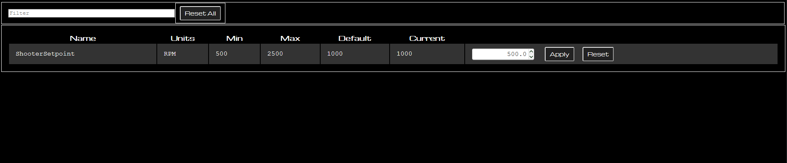
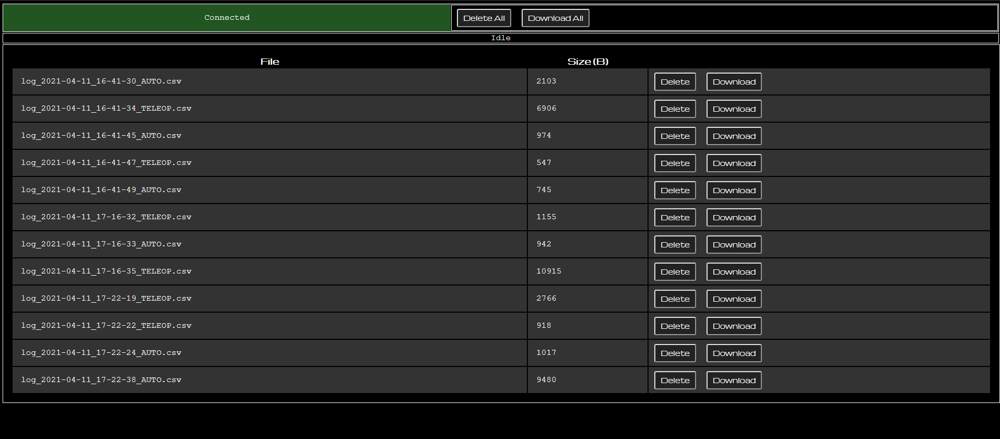
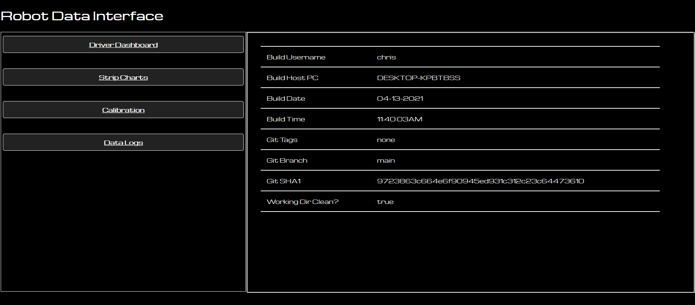

# Casserole Webserver 2.0

Webserver 2.0 builds on previous implementations of website and websocket data transport software components [designed to facilitate easy robot development workflows](https://trickingrockstothink.com/blog_posts/2020/05/05/data_acq.html).

See [the spec](spec.md) for more info.

This is a work in process.

# Front-End

HTML5/JS, served from the roboRIO. No tools to install. Cross-platform (including tablets & mobile devices). Interfaces automatically scale to available view area.

No web development skills required. Visual appearance & configuration done from Java user code.

## Dashboard

* Driver-Focused - At-A-Glance robot state notification
* ISO-like iconography
* Animation to keep visualization smooth even at slow data rates.
* Webcam Display, including fullscreen
* Autonomous chooser

## Stripcharts

 * Multi-Chart time-axis synchronized zoom & pan.
 * Flexible Capture/display lists
 * Saves current configuration to local storage for easy recall on page reload
 * Same-units plotted on same-y-axis
 * Load data from file or view live from RIO.

## Calibration

 * Configurable min/max/default constraints
 * Coming soon: Save/Load reporting

## Data Logs

 * View user-generated .csv timeseries log files present on RIO
 * Download & Delete operations
 * View current logging status (actively creating new log, idle, etc.)

## Build Info

* View gradle & git generated info at build time
* Helps uniquely identify the software version running on the RIO

# Back-End

## Base Layer

NT4 - coming soon!

## User Abstractions

On top of NT4, two main abstractions are implemented:

### Signal

A **Signal** is a numeric (boolean, integer, floating point) value with an assigned _name_ and _unit_. 

It is tied to a single class-member variable in software. An `@Signal` annotation is the primary way to accomplish this.

A signal gathers timestamped values at runtime, which can be consumed in multiple ways.

Currently, the timestamped values are:

1) Sent to NT4
2) If in autonomous or teleop, sent to onboard .csv file logging infrastructure.

Currently, signal values are assumed to be _generated_ on the roboRIO and _consumed_ by one or more dashboard-like client interfaces. 

### Calibration

A **Calibration** is a floating-point value with an assigned _name_, _unit_, and _default_ value. Optionally, it may also specify a _minimum_ and _maximum_ value.

All items are published to NT4 by the RIO.

The RIO owns the calibration's configuration and current value. Client programs may modify the current value via NT4. 

The Calibration is tied to a specific object in java code, with a `.get()` method to get the current value.

Coming Soon: 

-- User code may choose when to consume a new calibration value (EX: prohibit changing PID values while not in disabled). Whether the calibration value update has been consumed or not will be reported in the UI.
-- Annotation-based calibration support.
