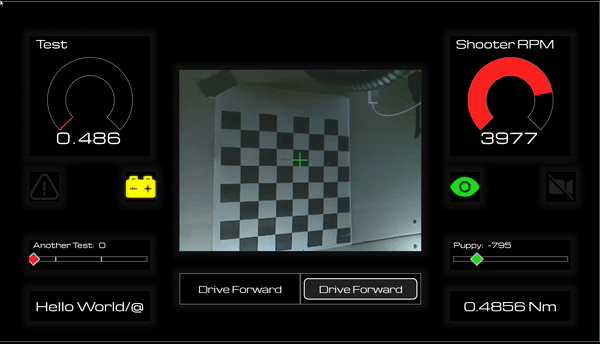
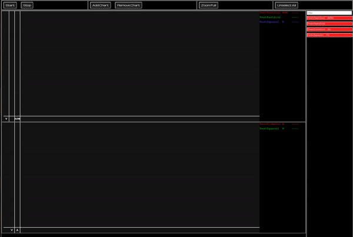

# Casserole Webserver 2.0

Webserver 2.0 builds on previous implementations of website and websocket data transport software components [designed to facilitate easy robot development workflows](https://trickingrockstothink.com/blog_posts/2020/05/05/data_acq.html).

See [the spec](spec.md) for more info.

This is a work in process.

# Back-End

NT4 - coming soon!

# Front-End

HTML5/JS, served from the roboRIO. No tools to install. Cross-platform (including tablets & mobile devices).

## Dashboard

* Driver-Focused - At-A-Glance robot state notification
* Webcam Display
* Autonomous chooser

## Stripcharts

 * Multi-Chart time-axis synchronized zoom & pan.
 * Flexible Capture/display lists
 * Saves current configuration to local storage for easy recall on page reload
 * Same-units plotted on same-y-axis

## Calibration

## Data Logs